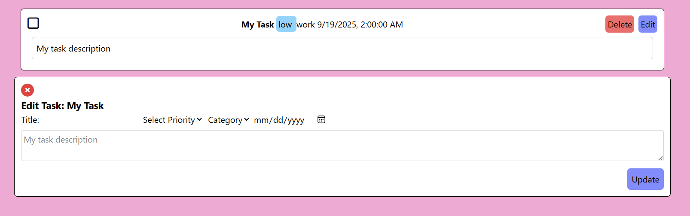

# Weather App 🌤️

This is a simple weather app that fetches live weather data from [wttr.in](https://wttr.in) and displays it in the browser.
  

---

## Features
- Enter a city name and fetch the weather instantly.
- Default city is **Stockholm** if no city is entered.
- Shows the result directly in the browser instead of only in the console.

---

## How It Works
1. The app uses **TypeScript / JavaScript** with the `fetch()` API.
Weather data is retrieved from:  [wttr.in Stockholm city](https://wttr.in/{Stockholm}?format=3)

  
## Node.js + TypeScript backend that handle Weather API integration

# Quote API 💡
This is a simple quote app that fetches a random quote when the Inspire Me button is pressed.

# Task Manager 📋
Task manager that lets you create, edit, mark complete, and delete tasks.

